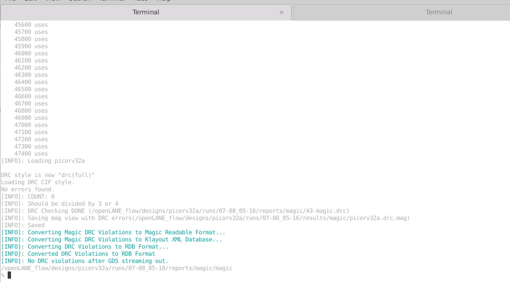

# OpenSource Physical Design
  This repository contains all the information studied and created during the [Advanced Physical Design Using OpenLANE / SKY130](https://www.vlsisystemdesign.com/advanced-physical-design-using-openlane-sky130/) workshop. It is primarily foucused on a complete RTL2GDS flow using the open-soucre flow named OpenLANE. [PICORV32A](https://github.com/cliffordwolf/picorv32) RISC-V core design is used for the purpose.

# Table of Contents
  - [Introduction To RTL to GDSII Flow](#introduction-to-rtl-to-gdsii-flow)
  - [About Google SkyWater PDK](#about-google-skywater-pdk)
  - [List of All Open-Source Tools Used](#list-of-all-open-source-tools-used)
  - [Setting Up Environment](#setting-up-environment)
  - [Day 1 -Introduction to open-source EDA, OpenLANE and Sky130 PDK](#day-1---introduction-to-open-source-eda-openlane-and-sky130-pdk)
    - [Basic IC Design Terminologies](#basic-ic-design-terminologies)
    - [Introduction To RISC-V](#introduction-to-risc-v)
    - [SoC Design and OpenLANE](#soc-design-and-openlane)
      - [Open-Source PDK Directory Structure](#open-source-pdk-directory-structure)
      - [What is OpenLANE](#what-is-openlane)
    - [Open-Source EDA Tools](#open-source-eda-tools)
      - [OpenLANE Initialization](#openlane-initialization)
      - [Design Preparation](#design-preparation)
      - [Design Synthesis and Results](#design-synthesis-and-results)
  - [Day 2 - Introduction to library cells and a comparison of good and bad floorplans](#day-2---introduction-to-library-cells-and-a-comparison-of-good-and-bad-floorplans)
    - [Chip Floorplanning](#chip-floorplanning)
      - [Utilization Factor and Aspect Ratio](#utilization-factor-and-aspect-ratio)
      - [Power Planning](#power-planning)
      - [Pin Placement](#pin-placement)
      - [Floorplan using OpenLANE](#floorplan-using-openlane)
      - [Review Floorplan Layout in Magic](#review-floorplan-layout-in-magic)
    - [Placement](#placement)
      - [Placement and Optimization](#placement-and-optimization)
      - [Placement using OpenLANE](#placement-using-openlane)
    - [Cell Design and Characterization Flows](#cell-design-and-characterization-flows)
      - [Cell Design Flow](#cell-design-flow)
      - [Characterization Flow](#characterization-flow)
  - [Day 3 - Using Magic Layout and ngspice characterization create a library cell](#day-3---using-magic-layout-and-ngspice-characterization-create-a-library-cell)
    - [CMOS Inverter Design using Magic](#cmos-inverter-design-using-magic)
    - [Extract SPICE Netlist from Standard Cell Layout](#extract-spice-netlist-from-standard-cell-layout)
    - [Transient Analysis using NGSPICE](#transient-analysis-using-ngspice)
  - [Day 4 - Analysis of pre-layout timing and the significance of a good clock tree](#day-4---analysis-of-pre-layout-timing-and-the-significance-of-a-good-clock-tree)
    - [Magic Layout to Standard Cell LEF](#magic-layout-to-standard-cell-lef)
    - [Plugging custom LEF to Openlane](#plugging-custom-lef-to-openlane)
    - [Timing Analysis using OpenSTA](#timing-analysis-using-opensta)
    - [Clock Tree Synthesis using TritonCTS](#clock-tree-synthesis-using-tritoncts)
  - [Day 5 - RTL2GDS Final Steps](#day-5---rtl2gds-final-steps)
    - [Generation of Power Distribution Network](#generation-of-power-distribution-network)
    - [Routing using TritonRoute](#routing-using-tritonroute)
    - [DRC Check After Routing](#drc-check-after-routing)
    - [SPEF File Generation](#spef-file-generation)
  - [References](#references)
  - [Acknowledgement](#acknowledgement)
 
# Introduction To RTL to GDSII Flow
  RTL to GDSII Flow refers to the all the steps involved in converting a logical Register Transfer Level(RTL) Design to a fabrication ready GDSII format. GDSII is a database file format which is an industry standard for data exchange of IC layout artwork.
  The RTL to GSDII flow consists of following steps:
  - RTL Synthesis
  - Static Timing Analysis(STA)
  - Design for Testability(DFT)
  - Floorplanning
  - Placement
  - Clock Tree Synthesis(CTS)
  - Routing
  - GDSII Streaming
 
 All the steps are further discussed in details in the repository.
  
# About Google SkyWater PDK
  Google and SkyWater Technology Foundry in collaboration have released a completely open-source Process Design Kit(PDK) in May, 2020. The current release target to a SKY130 (i.e. 130 nm) process node is available as [SkyWater Open Source PDK](https://github.com/google/skywater-pdk). The PDK provides Physical VLSI Designer with a wide range of flexibility in design choices. All the designs and simulations listed in this repository are carried out using the same SkyWater Open Source PDK.

# List of All Open-Source Tools Used
  | Name of Tool | Application / Usage |
  | --- | --- |
  | [Yosys](https://github.com/YosysHQ/yosys) | Synthesis of RTL Design |
  | ABC | Mapping of Netlist |
  | [OpenSTA](https://github.com/The-OpenROAD-Project/OpenSTA) | Static Timing Analysis |
  | [OpenROAD](https://github.com/The-OpenROAD-Project/OpenROAD) | Floorplanning, Placement, CTS, Optimization, Routing |
  | [TritonRoute](https://github.com/The-OpenROAD-Project/TritonRoute) | Detailed Routing |
  | [Magic VLSI](http://opencircuitdesign.com/magic/) | Layout Tool |
  | [NGSPICE](https://github.com/imr/ngspice) | SPICE Extraction and Simulation |
  | SPEF_EXTRACTOR | Generation of SPEF file from DEF file |
  
# Setting Up Environment
  The above list of tools shows that, many different tools are required for various tasks in Physical VLSI Design. Each tool in itself have number of system requirements and require various supporting tools to be installed. Installing each tool one-by-one seems in-efficient. This is made easy by some custom scripts that setup the required tools and environment for them in just a few easy steps. To install all the required tools, one can refer to the below mentioned repositories:
  - [VSDFlow](https://github.com/kunalg123/vsdflow) - Installs Yosys, Magic, OpenTimer, OpenSTA and some other supporting tools
  - [OpenLANE Build Scripts](https://github.com/nickson-jose/openlane_build_script) - Install all required OpenROAD and some supporting tools
  
# Day 1 - Introduction to open-source EDA, OpenLANE and Sky130 PDK
 ## Basic IC Design Terminologies
  During the Physical Designing, one will come across multiple terminologies that are frequently used. Some of them are mentioned below:
  - Package: It is a case that surrounds the circuit material to protect it from physical damage or corrosion and allow mounting of the electrical contacts connecting it to the printed circuit board (PCB). The below snippet shows an IC with 48 pins and Quad Flat No-Leads(QFN) package.
  - Die: A die is a small block of semiconducting material on which a given functional circuit is fabricated.
  - Core: It is the actual area of the IC where the logic resides.
  - Pads: These are the interfaces between the internal signals of a chip and the external pins
 
  
 
 ## Introduction To RISC-V
   RISC-V is a new ISA that's available under open, free and non-restrictive licences. RISC-V ISA delivers a new level of free, extensible software and hardware freedom on architecture.
   - It is far simpler and smaller than other commercial ISAs available.
   - It avoids micro-architecture or technology dependent features.
   - It has small standard base ISA and multiple standard extensions.
   - It supports variable-length instruction encoding.
   A brief design for RISC-V core can be refered [here](https://github.com/ShonTaware/RISC-V_Core_4_Stage)
   
 ## SoC Design and OpenLANE
 ### Open-Source PDK Directory Structure
   All the Process Design Kit(PDK) are listed under the `pdks/` directory. Along with the `Sky130A` we are using some other open-source PDKs and other related files are also available in the directory. The location of the PDK directory is given of `$PDK_ROOT` variable. 
      
 ### What is OpenLANE
   [OpenLANE](https://github.com/efabless/openlane) is an automated RTL to GDSII flow which includes various open-source components such as OpenROAD, Yosys, Magic, Fault, Netgen, SPEF-Extractor. It also facilitates to add custom design exploration and optimization scripts.
   The detailed diagram of the OpenLANE architecture is shown below:
   
   
   
   OpenLANE flow consists of several stages. By default all flow steps are run in sequence. Each stage may consist of multiple sub-stages. OpenLANE can also be run interactively as shown here.

  1. Synthesis
      1. `yosys` - Performs RTL synthesis
      2. `abc` - Performs technology mapping
      3. `OpenSTA` - Pefroms static timing analysis on the resulting netlist to generate timing reports
  2. Floorplan and PDN
      1. `init_fp` - Defines the core area for the macro as well as the rows (used for placement) and the tracks (used for routing)
      2. `ioplacer` - Places the macro input and output ports
      3. `pdn` - Generates the power distribution network
      4. `tapcell` - Inserts welltap and decap cells in the floorplan
  3. Placement
      1. `RePLace` - Performs global placement
      2. `Resizer` - Performs optional optimizations on the design
      3. `OpenPhySyn` - Performs timing optimizations on the design
      4. `OpenDP` - Perfroms detailed placement to legalize the globally placed components
  4. CTS
      1. `TritonCTS` - Synthesizes the clock distribution network (the clock tree)
  5. Routing *
      1. `FastRoute` - Performs global routing to generate a guide file for the detailed router
      2. `TritonRoute` - Performs detailed routing
      3. `SPEF-Extractor` - Performs SPEF extraction
  6. GDSII Generation
      1. `Magic` - Streams out the final GDSII layout file from the routed def
  7. Checks
      1. `Magic` - Performs DRC Checks & Antenna Checks
      2. `Netgen` - Performs LVS Checks
      
 ## Open-Source EDA Tools
 ### OpenLANE Initialization
   For invoking OpenLANE in Linux Ubuntu, we should first run the docker everytime we use OpenLANE. This is done by using the following script:
    
    docker run -it -v $(pwd):/openLANE_flow -v $PDK_ROOT:$PDK_ROOT -e PDK_ROOT=$PDK_ROOT -u $(id -u $USER):$(id -g $USER) openlane:rc6
   
   A custom shell script or commands can be generated to make the task simpler.
   
   - To invoke OpenLANE run the `./flow.tcl` script.
   - OpenLANE supports two modes of operation: interactive and autonomous.
   - To use interactive mode use `-interactive` flag with `./flow.tcl`
   
   
   
 ### Design Preparation
   The first step after invoking OpenLANE is to import the openlane package of required version. This is done using following command. Here 0.9 is the required version of OpenLANE.
   
    package require openlane 0.9
    
   The next step is to prepare our design for the OpenLANE flow. This is done using following command:
       
    prep -design <design-name>
   
   Some additional flags that can be used while preparation are:
     <br />`-tag <name-for-current-run>` - All the files generated during the flow will be stored in a directory named `<name-for-current-run>`
     <br />`-overwrite` - If a directory name mentioned in `-tag` already exists, it will be overwritten.
   
   
   
   During the design preparation the technology LEF and cell LEF files are merged together to obtain a `merged.lef` file. The LEF file contains information like the layer information, set of design rules, information about each standard cell which is required for place and route. 
    
 ### Design Synthesis and Results
   The first step in OpenLANE flow is RTL Synthesis of the design loaded. This is done using the following command.
   
    run_synthesis
   
   
   


   
   After running the synthesis on the design we get the synthesis statistics along with the ``Synthesis was successful`` message. 
   The ``Flop Ratio`` can be calculated by Number of D Flip-Flops/Total Number of Cells, which can b calculated from the above statistic as 1613/14876 = 0.1084 or 10.84%. 
   
   
# Day 2 - Introduction to library cells and a comparison of good and bad floorplans
 ## Chip Floorplanning
   The arrangement of logical blocks, library cells, and pins on a silicon chip is known as chip floorplanning. It ensures that each module has an appropriate area and aspect ratio, that every pin of the module is connected to other modules or the chip's periphery, and that modules are arranged in such a way that they consume less area on a chip.
   
 ### Utilization Factor and Aspect Ratio
   The utilisation factor is the ratio of standard cell core area to total core area. The utilisation factor is usually kept between 0.5 and 0.7, i.e. 50 and 60 percent. Maintaining a proper utilisation factor makes optimization of placement and routing easier.
   
 ### Power Planning
   The creation of a power grid network to evenly distribute power to every component of the design is known as the power planning process. This process addresses the unwelcome voltage drop and ground bounce. The metal wires that make up the power distribution network have a resistance that results in steady state IR Drop. Stable-state IR Drop lowers the voltage differential between local power and ground, which lowers the speed and noise immunity of the local cells and macros.
   
 ### Pin Placement
   The position of the pin affects the timing delays and the number of buffers required, so pin placement is critical in floorplanning. Pin placement options include equidistant placement and high-density placement.
 
 ### Floorplan using OpenLANE
   Floorplanning in OpenLANE is done using the following command. 
    
    run_floorplan
   
   Successful floorplanning gives a `def` file as output. This file contains the die area and placement of standard cells.
   
   
 
 ### Review Floorplan Layout in Magic
 The Magic Layout Tool is used to visualise the layout after the floorplan has been created. The following three files are required to view a floorplan in Magic:
 1. Sky130A.tech Technology File
 2. LEF file that has been merged ('merged.lef')
 3. DEF Document
    
   
   
 
 ## Placement
 ### Placement and Optimization
   After floorplanning, the next step is placement. The placement of each component on the die is determined by placement. Placement does not simply place the standard cells from the synthesised netlist. It also optimises the design, removing any timing violations caused by die relative placement.
   
 ### Placement using OpenLANE
   Placement in OpenLANE is done using the following command. 
    
    run_placement
   
   The DEF file created during floorplan is used as an input to placement. Placement in OpenLANE occurs in two stages:
   - Global Placement
   - Detailed Placement
   
   Placement is carried out as an iterative process till the value of overflow converges to 0.
   
   
   
   <table border="0"><tr><td> </td><td>  </td></tr></table>
   
 ## Cell Design and Characterization Flows
 ### Cell Design Flow
  In a border view Cell Design flow is are the stages or steps involved in the entire design of a standard cell. The figure below shows the input, output and design steps involved in cell design
  
  
 
 ### Characterization Flow
  There are few problems of Standard Cells in polygon level format (GDSII). Some of them are:
  - Extraction of functionality is complicated and unnecessary as it is known
  - Functional/Delay simulation takes way too long
  - Power extraction for a whole chip takes too long
  - Automatic detection of timing constraints (e.g. Setup time) is difficult

  Cell Characterization is a solution to the problems mentioned above. It is a simple model for delay, function, constraints, and power at the cell/gate level. The Characterization Flow consists of the following stages:
  1. Netlist Extraction - Transistors, resistances and capacitances are extracted with special tools and saved as SPICE netlist (or similar)
  2. Specification of parameters - Library-wide parameters have to be specified: e.g. max Transition time
  3. Model selection and specification - The used models determine the required data
  4. Measurement - The cells are simulated with a SPICE-like tool to obtain the required data
  5. Model Generation - The obtained data is fed into the models
  6. Verification - Different checks are performed to ensure the correctness of the characterization
 
# Day 3 - Using Magic Layout and ngspice characterization create a library cell
  Each Design has an equivalent cell design. The Cell Library includes all of the standard cell designs. A completely unique cell design that complies with all of the rules can be added to the library. To begin, a CMOS inverter is designed in Magic Layout Tool and analysed with NGSPICE.
  
 ## CMOS Inverter Design using Magic
  Magic Layout Tool is used to design the inverter. It accepts the technology file ('sky130A.tech' in this case) as input. The Magic tool provides a very simple interface for designing various layers of the layout. It also includes a DRC check fetaure.
The snippet below depicts a CMOS inverter layout with and without design rule violations.
  
  <table border="0">
  <tr>
    <td> </td>
    <td>  </td>
  </tr>
  <tr>
    <td> </td>
    <td>  </td>
  </tr>
  </table>
  
 ## Extract SPICE Netlist from Standard Cell Layout
  A SPICE netlist of a given layout is required to simulate and verify the functionality of the designed standard cell layout. To summarise, "Simulation Program with Integrated Circuit Emphasis (SPICE)" is a design language for electronic circuitry that is widely used in the industry. The SPICE model closely resembles the actual circuit behaviour.
The SPICE model for a given layout is extracted in two stages.
  1. Extract the circuit from the layout design.
  
    extract all
  
  2. Convert the extracted circuit to SPICE model.
    
    ext2spice cthresh 0 rthresh 0
    ext2spice
  
  The extracted SPICE model like the first snippet shown below. Some modification are done to the SPICE netlist for the purpose of simulations, which is shown in the second snippet below.
  
  <table border="0">
  <tr>
    <td> <center>Commands for Extraction</center> <br /> </td>
    <td> <center>.ext file</center>  </td>
  </tr>
  <tr>
    <td> <center>Generated SPICE Netlist</center>  </td>
    <td> <center>Modified SPICE Netlist</center>  </td>
  </tr>
  </table>
  
 ## Transient Analysis using NGSPICE
  The SPICE netlist generated in previous step is simulated using the NGSPICE tool. NGSPICE is an open-source mixed-level/mixed-signal electronic spice circuit simulator.
  The command used to invoke NGSPICE is shown below.
  
    ngspice <name-of-SPICE-netlist-file>
    
  Following command is used to plot waveform in ngspice tool.
    
    ngspice 1 -> plot Y vs time A
    
   
   
   Below figure shows the waveform of Inverter output vs input w.r.t. time. Many timing parameters like rise time delay, fall time delay, propagation delay are calculated using this waveform.
   
   
  
# Day 4 - Analysis of pre-layout timing and the significance of a good clock tree
  To use a standard cell layout design in an OpenLANE RTL2GDS flow, it is converted to a standard cell LEF. LEF is an abbreviation for Library Exchange Format. After any addition or change to the design, the entire design must be analysed for any timing violations.
  
 ## Magic Layout to Standard Cell LEF
  We need some information about the layers in the designs before we can create the LEF file. This information is available in a 'tracks.info' file, as shown below. It specifies the 'offset' and 'pitch' of a track in a given layer in both the horizontal and vertical directions. The track information is presented in the format shown below.
  
    <layer-name> <X-or-Y> <track-offset> <track-pitch>
    
  
  
  To create a standard cell LEF from an existing layout, some important aspects need to be taken into consideration.
  1. The height of cell be appropriate, so that the `VPWR` and `VGND` properly fall on the power distribution network.
  2. The width of cell should be an odd multiple of the minimum permissible grid size.
  3. The input and ouptut of the cell fall on intersection of the vertical and horizontal grid line.
  
  <table border="0">
  <tr>
    <td> <center>Set Grid Alignment</center> <br /> </td>
    <td> <center>Create Port A</center>  </td>
  </tr>
  <tr>
    <td> <center>Create Port A</center>  </td>
    <td> <center>Set Class for Port A</center>  </td>
  </tr>
  </table>
  
  The custom LEF file
  ```
  VERSION 5.7 ;
  NOWIREEXTENSIONATPIN ON ;
  DIVIDERCHAR "/" ;
  BUSBITCHARS "[]" ;
MACRO sky130_inv
  CLASS CORE ;
  FOREIGN sky130_inv ;
  ORIGIN 0.000 0.000 ;
  SIZE 1.380 BY 2.720 ;
  SITE unithd ;
  PIN A
    DIRECTION INPUT ;
    USE SIGNAL ;
    ANTENNAGATEAREA 0.165600 ;
    PORT
      LAYER li1 ;
        RECT 0.060 1.180 0.510 1.690 ;
    END
  END A
  PIN Y
    DIRECTION OUTPUT ;
    USE SIGNAL ;
    ANTENNADIFFAREA 0.287800 ;
    PORT
      LAYER li1 ;
        RECT 0.760 1.960 1.100 2.330 ;
        RECT 0.880 1.690 1.050 1.960 ;
        RECT 0.880 1.180 1.330 1.690 ;
        RECT 0.880 0.760 1.050 1.180 ;
        RECT 0.780 0.410 1.130 0.760 ;
    END
  END Y
  PIN VPWR
    DIRECTION INOUT ;
    USE POWER ;
    PORT
      LAYER nwell ;
        RECT -0.200 1.140 1.570 3.040 ;
      LAYER li1 ;
        RECT -0.200 2.580 1.430 2.900 ;
        RECT 0.180 2.330 0.350 2.580 ;
        RECT 0.100 1.970 0.440 2.330 ;
      LAYER mcon ;
        RECT 0.230 2.640 0.400 2.810 ;
        RECT 1.000 2.650 1.170 2.820 ;
      LAYER met1 ;
        RECT -0.200 2.480 1.570 2.960 ;
    END
  END VPWR
  PIN VGND
    DIRECTION INOUT ;
    USE GROUND ;
    PORT
      LAYER li1 ;
        RECT 0.100 0.410 0.450 0.760 ;
        RECT 0.150 0.210 0.380 0.410 ;
        RECT 0.000 -0.150 1.460 0.210 ;
      LAYER mcon ;
        RECT 0.210 -0.090 0.380 0.080 ;
        RECT 1.050 -0.090 1.220 0.080 ;
      LAYER met1 ;
        RECT -0.110 -0.240 1.570 0.240 ;
    END
  END VGND
END sky130_inv
END LIBRARY

  ```
  
 ## Plugging custom LEF to Openlane

If a new custom cell needs to be plugged into openlane flow, include the lefs (the one extracted in [Step-5](#defining-lef-properties-and-extracting-lef-file)) as below:

- In the design's config.tcl file add the below line to point to the lef location which is required during spice extraction.
      
          set ::env(EXTRA_LEFS) [glob $::env(OPENLANE_ROOT)/designs/$::env(DESIGN_NAME)/src/*.lef]
      
- Include the below command to include the additional lef into the flow:
      
          set lefs [glob $::env(DESIGN_DIR)/src/*.lef]
        
          add_lefs -src $lefs
       
- Run the interactive flow as described [here.](https://github.com/efabless/openlane/blob/master/doc/advanced_readme.md)
  
 Custom LEF file present in synthesised netlist with name ``sky130_vsdinv``
 
  </td>
  
 ## Timing Analysis using OpenSTA
  The Static Timing Analysis(STA) of the design is carried out using the OpenSTA tool. The analysis can be done in to different ways.
  - Inside OpenLANE flow: This is by invoking `openroad` command inside the OpenLANE flow. In the openroad OpenSTA is invoked.
  - Outside OpenLANE flow: This is done by directly invoking OpenSTA in the command line. This requires extra configuration to be done to specific the verilog file, constraints, clcok period and other required parameters.
   
  OpenSTA is invoked using the below mentioned command.
  
    sta <conf-file-if-required>
  
  The above command gives an Timing Analysis Report which contains:
   1. Hold Time Slack
   2. Setup Time Slack
   3. Total Negative Slack (= 0.00, if no negative slack)
   4. Worst Negative Slack (= 0.00, if no negative slack)
  

 </td>

  
  If the design produces any setup timing violaions in the analysis, it can be eliminated or reduced using techniques as follows:
  1. Increase the clock period (Not always possible as generally operating frequency is freezed in the specifications)
  2. Scaling the buffers (Causes increase in design area)
  3. Restricting the maximum fan-out of an element. 
  
 ## Clock Tree Synthesis using TritonCTS
  Clock Tree Synthesis(CTS) is a process which makes sure that the clock gets distributed evenly to all sequential elements in a design. The goal of CTS is to minimize the clock latency and skew.
  There are several CTS techniques like:
  1. H - Tree
  2. X - Tree
  3. Fish bone
  
  In OpenLANE, clock tree synthesis is carried out using TritonCTS tool. CTS should always be done after the floorplanning and placement as the CTS is carried out on a `placement.def` file that is created during placement stage.
  
  The command used for running CTS in OpenLANE is given below.
  
    run_cts
    
   

# Day 5 - RTL2GDS Final Steps
 ## Generation of Power Distribution Network
   The generation of the power distribution network occurs before the placement step in a normal RTL to GDSII flow, but it occurs after the Clock Tree Synthesis in an OpenLANE flow (CTS). This step generates all of the tracks and rails needed to route power to the entire chip.
The following command is used to generate a power distribution network.
   
    gen_pdn
    
   
   
 ## Routing using TritonRoute
   TritonRoute, an open source router for modern industrial designs, is used by OpenLANE. The router is made up of several major components, such as pin access analysis, track assignment, initial detailed routing, search and repair, and a DRC engine.
   The routing process is implemented in two stages:
   1. Global Routing - Routing guides are generated for interconnects
   2. Detailed Routing - Tracks are generated interatively.
   TritonRoute 14 ensures there are no DRC violations after routing.
   
   The following command is used for routing.
   
    run_routing
    
   <table border="0">
   <tr>
    <td> <center>Magic view of Completed routing</center> <br /> </td>
    <td> <center>Routing Completed Message</center> <br /> </td>
   </tr>
   </table>
   
   ## DRC Check After Routing
   DRC check after ``run_routing`` is done with ``run_magic`` followed by ``run_magic_spice_export`` and ``run_magic_drc``.
   No DRC error found
   
   
   
 ## SPEF File Generation
   The IEEE standard Standard Parasitic Exchange Format (SPEF) is used to represent parasitic data of wires in a chip in ASCII format. SPEF captures parasitic resistance and capacitance in non-ideal wires.
For the generation of SPEF files, OpenLANE includes a tool called SPEF EXTRACTOR. It's a Python-based parser that takes the 'LEF' and 'DEF' files as input and generates the SPEF file. The SPEC EXTRACTOR is invoked using the following command.
   
    cd <path-to-SPEF_EXTRACTOR-tool-directory>
    python3 main.py <path-to-LEF-file> <path-to-DEF-file-created-after-routing>
    
   The below snippet shows a small part of the `.spef` file.
   
   
   
# References
  - RISC-V: https://riscv.org/
  - VLSI System Design: https://www.vlsisystemdesign.com/
  - OpenLANE: https://github.com/The-OpenROAD-Project/OpenLane

# Acknowledgement
  - [Kunal Ghosh](https://github.com/kunalg123), Co-founder, VSD Corp. Pvt. Ltd.
  - [Nickson Jose](https://github.com/nickson-jose)
